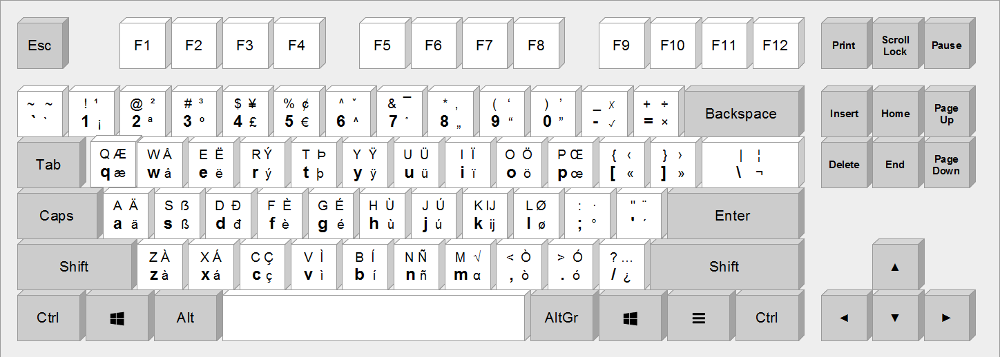
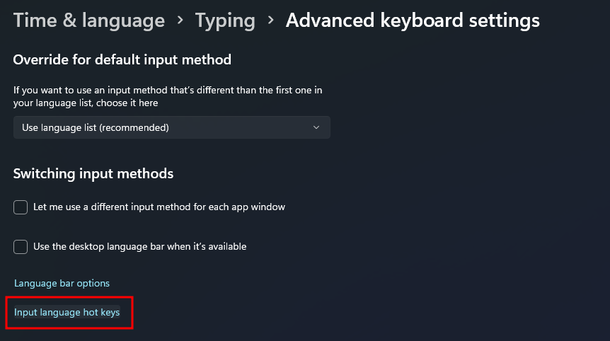
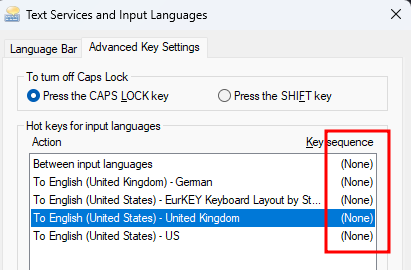
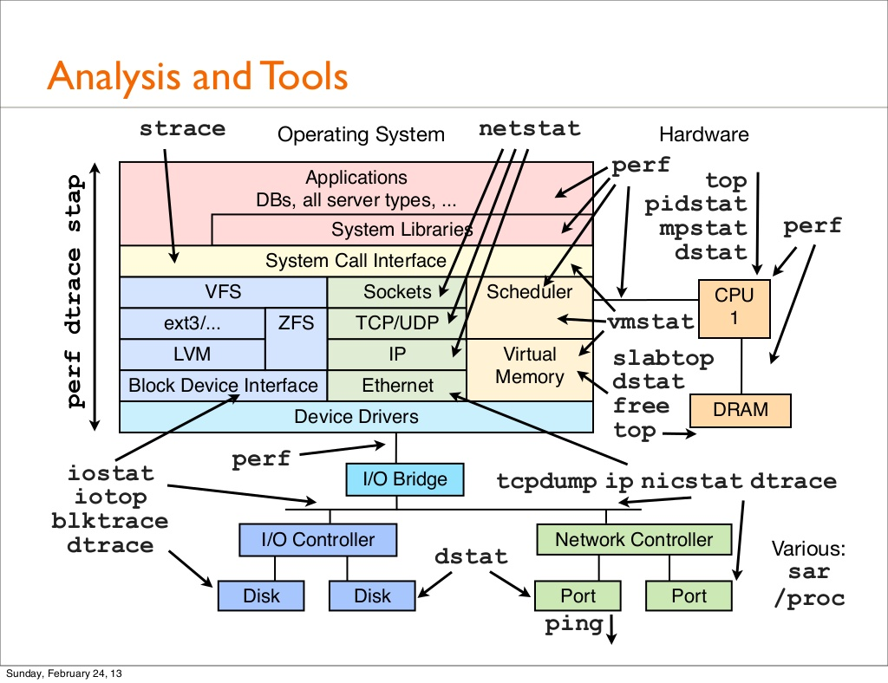

# Windows for Linux and MacOS devs

[GitHub Page](https://francescelies.github.io/windows-for-linux-and-macos-devs)

A hitchhiker's guide for Linux or MacOS devs who need to use windows.

<!--toc:start-->
- [Windows for Linux and MacOS devs](#windows-for-linux-and-macos-devs)
  - [A package manager](#a-package-manager)
  - [Are you an European coder?](#are-you-an-european-coder)
  - [Throw away tools that are not cross-platform and learn tools that you can use on every OS](#throw-away-tools-that-are-not-cross-platform-and-learn-tools-that-you-can-use-on-every-os)
  - [Windows specific stuff](#windows-specific-stuff)
    - [Disable annoying default hotkeys](#disable-annoying-default-hotkeys)
    - [Jumping between windows](#jumping-between-windows)
    - [Good to install](#good-to-install)
<!--toc:end-->

Going from MacOS or Linux to windows, why would you even do that? You might
ask. Maybe you have to share a laptop with family members who have Windows
installed? Would you really want to spend your energy convincing them that
Linux is a much better option? Or convince them to buy a expensive Mac? Making
the sweet promise that all their IT problems will be gone later on; they just
needed a bit of help. A different thing would be if they have an old laptop
that doesn't get any mac updates or they have windows but this old machine
became slower and slower because newer windows require a more powerful machine,
in that case, yes install a Linux and tell them you just saved their laptop, no
need to buy a new one.

Would you turn down an interesting job offer just because they use Windows?
They do some cool stuff, but their clients are using Windows. What would you do?
Convince the client mega-corporation to switch to Linux? Dump the offer and
continue at your non-fulfilling job because they gave you a Mac?

Unless you are in a privileged position where you can choose the OS you develop
on, chances are that you will have to touch other Operating Systems in the
future too.

We have several options, never touch windows, one could throw away tools that
don't work on windows and learn different tools for each OS or you could throw
away tools that are not cross-platform and learn tools that you can use on
every OS.

If you use apps that work on multiple operating systems you won't need to keep
forgetting and relearning different tools that solve the same problem on each
OS. In a way the OS becomes something like your graphics cards driver, you
don't care much about it as long as it does it's job, even though not
completely the OS starts getting out of the way.

Finding good resources is not easy, I did not come across many resources
covering this topic, but the ones I found where mainly saying, use WSL and run
the tools you are used to over there, e.g. tmux.
I think WSL is amazing, but in my experience, it's works great until you need
to do native things and then you are again left naked in the middle of the blue
ocean. At the end of the day in my opinion not very good advice.

Luckily Chris Patti & Ned Batchelder have some good advice on their pages.

- [windows - _Ned Batchelder_](https://nedbatchelder.com/blog/tag/windows.html)
- [windows papercuts for nix developers - _Chris Patti_](https://www.feoh.org/posts/windows-papercuts-for-nix-developers)
- Do you know a good resource? Click _Improve this page_ at the bottom or
create a pr.

This are notes I wished I found before I went through discovering what worked
and what did not work so well on windows. E.g. using emacs on windows was a
pain, git was extremely slow and I had to make a prayer every time I updated
packages, things getting broken became the norm and on top of that I faced gpg
errors during updates, maybe things changed now but moved on to something else.

## A package manager

There are other package managers too but
[winget](https://learn.microsoft.com/en-us/windows/package-manager/winget/#install-winget)
is from microsoft itself and you can get a lot of stuff from one command
already.

    winget install wez.wezterm Nushell.Nushell Dystroy.broot sysinternals BurntSushi.ripgrep.MSVC sharkdp.fd junegunn.fzf JesseDuffield.lazygit Git.Git GitHub.GitHubDesktop GitHub.GitLFS GitHub.cli Flameshot.Flameshot Python.Python.3.12 GoLang.Go Rustlang.Rustup OBSProject.OBSStudio Neovim.Neovim GIMP.GIMP vscode VideoLAN.VLC SumatraPDF.SumatraPDF

Looking for a package, use `winget search` or look [winget-pkgs](https://github.com/microsoft/winget-pkgs)

## Are you an European coder?

If you are non english native speaker you can use _The Layout for Europeans,
Coders and Translators_ [eurkey](https://eurkey.steffen.bruentjen.eu/). It has
all the advantages of the US standard layout for programming while you still
have access to most western-european characters, e.g. `çßàáäßæå` can be written
with ease using `AltGr`. For other languages like Thai, Chineese, russian ... I
don't have any suggestions.

## Throw away tools that are not cross-platform and learn tools that you can use on every OS

- Code editors: [VSCode](https://github.com/microsoft/vscode),
[nvim](https://github.com/neovim/neovim) +
[kickstart](https://github.com/nvim-lua/kickstart.nvim) and
[helix](https://helix-editor.com)
- Terminal: [Wezterm](https://github.com/wez/wezterm)
- Shell: [Nushell](https://www.nushell.sh) and [PowerShell](https://learn.microsoft.com/en-us/powershell)
- Git UI: [Github Desktop](https://github.com/desktop/desktop),
[Lazygit](https://github.com/jesseduffield/lazygit)
- Screen sharing: [Flameshot](https://flameshot.org),
[OBS Studio](https://obsproject.com) and [Gimp](https://www.gimp.org),

[Wezterm](https://wezfurlong.org/wezterm) as of today to my knowledge the only
terminal with tmux like capabilities that works nicely across all major three
OS. Check [Default Key
Assignments](https://wezfurlong.org/wezterm/config/default-keys.html), `ctrl +
shift + alt + "` for vertical splits `ctrl + shift + alt + %` for horizontal
splits and `ctrl + shift + z` to zoom should be enough to get you started,
eventually you will probably want to define your own shortcuts, create new
sessions with ease (see
[here](https://github.com/wez/wezterm/discussions/4796#discussioncomment-10329727)),
all can be done with Lua within `.wezterm.lua` in your home folder.
I personally like `alt` + `h j k l` for moving between splits and `alt + -` and
`alt + \` for vertical and horizontal splits (see
[here](https://github.com/FrancescElies/wezterm-config/)).

[Nushell](https://www.nushell.sh) is a cross platform shell with clearer error
messages with cues from bash and powershell, it also uses
[coreutils](https://github.com/uutils/coreutils) internally, so many unix
utilities you know they are already available without having to install
something like cygwin.
[Coming form bash](https://www.nushell.sh/book/coming_from_bash.html) is a good
place to start. If you like fzf search for `change_dir_with_fzf` in
[here](https://www.nushell.sh/book/line_editor.html#keybindings) has a low
effort snippet to change directories effectively, I personally prefer
[broot](https://dystroy.org/broot) for that but just use whatever floats your
boat.

[Flameshot](https://flameshot.org) is an easy to use tool to share screenshots
explaining what's going on, good for making bug reports and explaining things.

## Windows specific stuff

Some stuff will be very windows specific but that's ok, at the end of the day
you are here using windows right?

### Disable annoying default hotkeys

If you accidentally press `Win + SPACE` , `ALT + SHIFT` or `CTRL + SHIFT`
keyboard layouts and languages will change behind the scenes. This was never
what I wanted. Disable them and save you headaches.

Open

And remove all key sequences

### Jumping between windows

Pin the apps you use the most to your taskbar and use the windows key plus a
number (`Win + 1`, `Win + 2`, ...) to jump between them instead of alt
tabbing between apps you frequently use

In the example below it would trigger the following apps `Win + 1` Wezterm,
`Win + 2` Firefox `Win + 3` Gimp, `Win + 4` DebugView, `Win + 5` System Informer.

In _Gnome Desktop_ in Linux if you pin and keep apps in the same order in the
tab bar you can use the same shortcuts across different OS too.

### Good to install

If you install one thing only, install
[system-informer](https://github.com/winsiderss/systeminformer) or [process
explorer](https://learn.microsoft.com/en-us/sysinternals/downloads/process-explorer).
A better task manager, impressive, play around with it to see what it can do
for you. Many things Sysinternals do, you can do it directly from
system-informer.

### Troubleshooting an issue?

Even if they are not the same
[sysinternals](https://learn.microsoft.com/en-us/sysinternals) seems to be the
closest thing for instruments or dtrace on mac or strace and friends on linux.

Not windows but for MacOS and linux
[brendangregg](https://www.brendangregg.com/overview.html) is worth to read.

On linux:

| Linux  | MacOS  | Windows |
| ------ | ------ | ------- |
| strace | dtrace | procmon |
| TODO   | TODO   | TODO    |

- `strace`

For more low level stuff like
[dtrace](https://www.brendangregg.com/dtrace.html) or [ebpf](https://ebpf.io/)
look at [ebpf-for-windows](https://github.com/microsoft/ebpf-for-windows).

Below a non exhaustive list of things you can do with it:

- Need a monitoring tool (something like `lsof` or `strace`)?
[procmon](https://learn.microsoft.com/en-us/sysinternals/downloads/procmon)
shows real-time file system, Registry and process/thread activity. When first
having a look at an issue, this is a good tool to start with it.
[ProcMon-for-Linux](https://github.com/Sysinternals/ProcMon-for-Linux) exists too.
- Need to generate process dumps when a process has a hung or crashes? Use
[procdump](https://learn.microsoft.com/en-us/sysinternals/downloads/procdump),
it works on [linux](https://github.com/Sysinternals/ProcDump-for-Linux) too
[ProcDump-for-Linux](https://github.com/Sysinternals/ProcDump-for-Linux) exists too.
- Need to  monitor and log system activity across system reboots?
[sysmon](https://learn.microsoft.com/en-us/sysinternals/downloads/sysmon).
[Sysmon-for-Linux](https://github.com/Sysinternals/SysmonForLinux) exists too.
- See what files are open by which processes? Use
[handle](https://learn.microsoft.com/en-us/sysinternals/downloads/handle)
`handle -v | fzf` to filter or do that in system-informer.
- Programs configured to startup automatically? Use
[autoruns](https://learn.microsoft.com/en-us/sysinternals/downloads/autoruns)
- Having to do technical presentations or a demo?
[zoomit](https://learn.microsoft.com/en-us/sysinternals/downloads/zoomit)
allows you to screen zoom, do annotations and so on.
